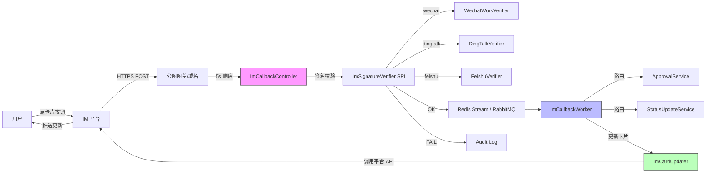

# IM OAuth 接入决策建议

> **spike 输出 / WP-M6-03 / T-03 + T-04 + T-05**
> 配套文档:[三平台 OAuth 对比](2026-08-07-im-oauth-flow-comparison.md)
> 决策推荐:**选项 B(推迟 v5)**
> 若采纳,产出 [ADR 004](../decisions/004-im-callback-deferred.md)

---

## 1. 决策摘要

| 选项 | 描述 | 工作量 | 时间窗 | 推荐度 |
|---|---|---|---|---|
| **A. 进 M6 范围** | 本期实现 IM OAuth + 卡片回调 | 17 人天 | M6 门禁延期 4 周 | ⭐ |
| **B. 推迟 v5** ⭐ | 本期不动,v5 立项时一并评估 | 0 (本期) | v5 启动时再 spike | ⭐⭐⭐ |
| **C. 砍掉** | M6 维持现状,卡片交互永远不做 | 0 | — | ⭐⭐ |

**推荐 B**。本期不增加 17 人天投入,把"卡片一键审批"放到 v5 立项时,与 AI 智能审批 / 移动端 IM SDK 一起评估。

---

## 2. 三选项详细分析

### 选项 A — 进 M6 范围(本期做)

#### 工作量分解(参考 plan §T-04)

| 模块 | 人天 | 说明 |
|---|---|---|
| 三平台 OAuth 接入(应用 + 用户 token) | 5 | 各 1.5 天 + 公用 0.5 |
| 卡片发送(3 平台 SDK 适配) | 3 | 模板卡片 / 互动卡片 / 飞书卡片 |
| 卡片回调签名校验(3 平台) | 2 | SHA1 / HMAC-SHA256 × 2 |
| 业务回调处理(审批 + 状态卡片) | 3 | 与现有 ApprovalService 联动 |
| 卡片异步更新 + 重试 | 2 | 死信队列 + 5s 超时降级 |
| 公网 HTTPS 域名 + 备案 | 1 | 走运维(已计) |
| 灰度开关 + 回滚 | 1 | per-user 灰度 |
| 单测 + 集成测试 | 3 | 三平台 mock |
| 文档 + ADR | 1 | 三平台适配指南 |
| **合计** | **17 人天 ≈ 3.5 周**(1 人全职) |

#### 收益
- ✅ 移动端审批体验大幅提升(不用打开 web)
- ✅ M6 范围完整,IM 多通道闭环
- ✅ 决策权"现在定",不拖到 v5

#### 代价
- ❌ M6 门禁延期 4 周(2026-08-28 → 2026-09-25)
- ❌ 公网 HTTPS 域名 + 备案(国内 7-15 天流程)
- ❌ 长期维护:三平台 API 变更需跟进
- ❌ **测试环境回调困难**:无公网域名时无法联调(可用 ngrok / 钉钉 Stream 模式变通)

#### 风险(详见 OAuth 对比文档 §6)

- R-010 公网域名备案阻塞(关键路径)
- R-011 签名算法混淆(安全风险)
- R-012 5s 响应窗口过紧(架构压力)
- R-013 平台限频(需要限流中间件)

---

### 选项 B — 推迟 v5(本期不做) ⭐ 推荐

#### 工作量
**0**(本期)

#### 路径
1. 本期关闭 WP-M6-03 spike,在 [STATUS.md §4](../STATUS.md) 关闭 R-002(原"IM OAuth 未评估")风险
2. 写 [ADR 004](../decisions/004-im-callback-deferred.md) 记录决策:本期不做,v5 评估
3. v5 立项(预计 2026-Q4)时,把"IM 卡片回调 + AI 智能审批 + 移动端 SDK"作为一组,统一 spike 评估

#### 收益
- ✅ 本期不延期,按 M6 既有范围(单向 IM 通知 + Web 审批)交付
- ✅ 把 17 人天 + 不可控因素(域名 / 备案)挪到 v5,届时技术栈更成熟
- ✅ v5 一起评估可能产生更大价值(AI 自动审批减少 IM 交互需求)
- ✅ 触发 v5 立项的实质启动

#### 代价
- ❌ 短期内移动端无"卡片一键审批"能力
- ❌ PMO / 用户期望管理:M6 通知能力比 M5 强(覆盖企业微信/钉钉/飞书三通道),但交互能力未升级

#### 风险
- R-016:用户反馈"为什么不支持卡片审批" → 缓解:CHANGELOG + Release Notes 明确"v5 路线图"
- R-017:v5 立项拖延 → 缓解:在 STATUS.md 跟踪,季度 review 提醒

---

### 选项 C — 砍掉(永久不做)

#### 工作量
**0**

#### 路径
1. WP-M6-03 关闭
2. R-002 改为"已砍掉",从风险登记移除
3. ADR 记录决策理由

#### 收益
- ✅ 最简单,无任何交付压力

#### 代价
- ❌ 永久无移动端审批能力
- ❌ IM 通道沦为"通知推送",没有互动价值
- ❌ 与市面主流 PMO 工具拉开差距(Worktile / Jira 都支持)

**不推荐**:除非 PMO 明确判断 ROI 极低,否则不应永久砍掉。

---

## 3. 推荐方案:选项 B 详细路径

### 3.1 本期(本周内)

| 步骤 | 产出 |
|---|---|
| 1. 评审 spike 报告 | PMO 接受 B 方案 |
| 2. 写 ADR 004-im-callback-deferred.md | 决策正式化 |
| 3. 更新 STATUS.md | R-002 关闭;M6 进度维持 |
| 4. 更新 WBS.md | WP-M6-03 状态 → completed(评估完成) |
| 5. CHANGELOG.md | 加 [Spike] 段,记录决策 |

### 3.2 v5 立项时(预计 2026-Q4)

| 步骤 | 产出 |
|---|---|
| 1. 重新 spike | 公网域名是否就绪?三平台政策变化?SDK 选型? |
| 2. 范围冻结 | "卡片回调 + AI 智能审批 + 移动端" 三件套 |
| 3. 工作量重估 | 基于 v5 技术栈再估 |
| 4. ADR 005+ | 实施决策 |

### 3.3 本期 M6 的替代交付

由于不做卡片回调,M6 范围调整为:

| 现状 | 本期调整 |
|---|---|
| 三平台 IM 通知(企业微信/钉钉/飞书) | ✅ 维持,已部分实现 |
| 单向通知(无回调) | ✅ 维持 |
| Web 内审批 | ✅ 维持 |
| 用户 IM 绑定(扫码关注 + 消息路由) | ✅ 维持 |

**实质**:M6 范围不变,只是把"卡片回调"从 M6 拆出来挪到 v5。

---

## 4. Mermaid 最小可用架构图(若将来选 A 实施方案参考)

### 关键组件

| 类 | 职责 | 行数估计 |
|---|---|---|
| `ImCallbackController` | `/api/im/callback/{platform}` 入口 | 80 |
| `ImSignatureVerifier` (接口) | 签名校验 SPI | 30 |
| `WechatWorkSignatureVerifier` | SHA1 + AES-256 | 200 |
| `DingTalkSignatureVerifier` | HMAC-SHA256 | 150 |
| `FeishuSignatureVerifier` | HMAC-SHA256 + encryptKey | 200 |
| `ImCallbackProcessor` | 业务路由(approval / status) | 400 |
| `ImCardUpdater` | 异步卡片更新 + 重试 | 300 |
| `ImOAuthService` | 3 平台 OAuth 客户端 | 600 |
| `ImCardSender` | 3 平台卡片发送 | 900 |

---

## 5. 决策建议

### 5.1 PMO 评审 checklist

- [ ] 是否接受"卡片审批"延期到 v5?
- [ ] 是否接受 M6 范围维持(纯单向通知)?
- [ ] 是否同意本期内关闭 R-002?
- [ ] 是否同意 ADR 004 落地?

### 5.2 备择情景

若 PMO 评审时选择 A,本 spike 文档可作为 T-03(架构)和 T-04(工作量估算)的输入,直接进入开发阶段。

若选择 C,本 spike 文档作为"永久不做"的存档,不再迭代。

---

## 6. 风险缓解(R-002 关闭 + 新增)

### 关闭
- **R-002**(IM 平台 OAuth 工作量未评估):本 spike 关闭 → 转为 R-018(决策待 PMO 评审)

### 新增(若选 B)
- **R-018**(v5 立项拖延):季度 review 跟踪
- **R-019**(用户反馈"无卡片审批"):CHANGELOG 明确说明 + Release Notes

### 维持
- **R-006/007/008**(WP-M5-02 风险):与本决策无关
- **R-001**(财务对账口径):与本决策无关

---

## 7. 参考文档

- [三平台 OAuth 对比](2026-08-07-im-oauth-flow-comparison.md)
- [WP-M6-03 plan](../plans/2026-08-07-wp-m6-03-im-callback-spike.md)
- [ADR 004(决策正式化)](../decisions/004-im-callback-deferred.md)
- [STATUS.md §4 风险登记](../STATUS.md)
- [WBS.md WP-M6-03](../WBS.md#wp-m6-03-im-平台回调接入评估)
